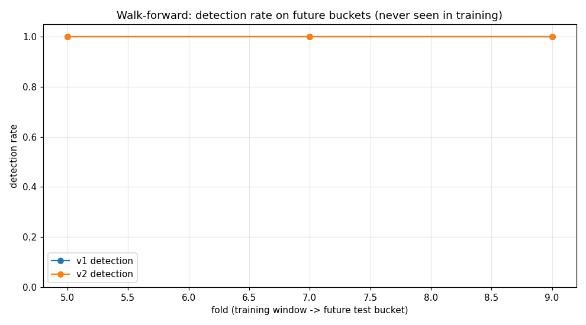

# RansomGuard

[](https://github.com/Farooq-Syed/ransomguard/actions/workflows/ci.yml)


Early-warning ransomware detector for a single machine. Continuously watches your data files,
system-critical files, decoy "canary" files, running processes and system resources, and raises
alerts when behaviour matches how ransomware works — before the whole disk is encrypted.

Two detection engines, comparable side by side:

| Version | Approach | Status |
|---|---|---|
| **v1** | Rule/heuristic scoring engine | 100% detection, 0% FP (synthetic suite) |
| **v2** | ML detector: calibrated RandomForest + IsolationForest anomaly layer + streak logic + LIME explanations + drift monitor | Trained on 800 sessions; 100% detection, 0% FP; more precise than v1 on noisy-but-benign workloads |

Both share the same scanning core (filesystem snapshot/diff, honeypots, process and resource
monitors) — only the scoring differs.

**Docs:** full test results and analysis in [FINDINGS.md](FINDINGS.md); prioritized next steps in
[ROADMAP.md](ROADMAP.md); charts under `results/`.

---

## Why these files? (research)

Ransomware follows a very predictable playbook (MITRE ATT&CK [T1486](https://attack.mitre.org/techniques/T1486/)
"Data Encrypted for Impact"). It targets **common user files** — Office documents, PDFs, images,
videos, audio, text, source code — while typically **avoiding** executables and system DLLs so the
OS stays alive to keep running. It then:

1. Rewrites files in place with an encrypted (high-entropy) stream
2. Renames files, appending a marker extension (`.lockbit`, `.ryuk`, `.conti`, `.enc`, `.locked`, ...)
3. Drops ransom notes (`README_RESTORE.txt`, `RyukReadMe.txt`, `!read_me_medusa!!.txt`, ...)
4. Deletes volume shadow copies (`vssadmin delete shadows /all /quiet`)
5. Works fast — hundreds of files per minute

### Prioritised target list (used for early-warning configuration)

| Priority | What ransomware wants | Examples |
|---|---|---|
| **95** | Private keys, wallets, credentials | `~/.ssh`, `~/.gnupg`, `~/.aws`, `.pem`, `.pfx`, `.jks`, `.wallet` |
| **90+** | Critical OS state | `hosts`, registry hives (`SAM`, `SYSTEM`, `SECURITY`), `BCD` boot config |
| **70** | Documents & Office files | `.docx`, `.xlsx`, `.pptx`, `.pdf`, `.rtf`, `.odt` |
| **55–70** | Photos & media | `.jpg`, `.png`, `.raw`, `.mp4`, `.mkv`, `.mov` |
| **55** | Databases | `.sql`, `.sqlite`, `.accdb`, `.mdb`, `.db` |
| **50–60** | Backups & archives | `.bak`, `.zip`, `.rar`, `.7z`, `.vmdk`, `.vhdx`, `.ost`, `.pst` |
| **40** | Source code & config | `.py`, `.java`, `.js`, `.yaml`, `.env`, `.json` |

The core principle for "early precautions": **watch the files that are rarely touched**. A file that
sat untouched for 30+ days suddenly being rewritten with high-entropy content is a far stronger
signal than a daily-edited spreadsheet changing.

---

## Detection signals (v1 heuristic engine)

Every scan window produces a weighted suspicion score. `HIGH`+ alerts are only raised when at least
one **strong signal** is present, to avoid false alarms on normal use:

- **High file entropy** (encrypted data is statistically random) — strong
- **File magic-byte change** (a PDF that is no longer a PDF) — strong
- **Extension churn / mass renames** to ransom-style extensions — strong
- **Ransom note creation** (name + location heuristics) — strong
- **Honeypot / canary file touched** — strong (nothing legitimate ever touches these)
- **Shadow-copy deletion** via `vssadmin`/`wmic`/`bcdedit` — strong
- **Suspicious process** from `Temp`/`AppData` running known crypto utilities — strong
- **Mass modification rate** (hundreds of files/min) — strong
- Age of file + rarity of the path — weights the score per path priority
- CPU / memory / disk-write bursts — corroborating signals

On `CRITICAL`/`PANDEMIC` the detector can optionally **quarantine** the flagged files and (if
`auto_freeze`) suspend the offending process.

---

## Quick start

```bash
pip install -r requirements.txt

# 1. Tune the watch list to your machine (paths, priorities, honeypot dirs)
python main.py --check-config

# 2. Plant decoy canary files in the monitored folders
python main.py --setup-honeypots

# 3. See what your setup actually watches (prioritised inventory)
python main.py --scan-once

# 4. Run the continuous monitor
python main.py
```

Other commands:

```bash
python main.py --freeze-now        # emergency: suspend suspicious processes
python main.py --remove-honeypots  # clean up canaries
```

### v2 (ML)

```bash
python train_v2.py --n-benign 400 --n-ransom 400 --seed 42   # train a fresh model
python -m ransomguard_ml.monitor --model models/v2_model.pkl # run the ML monitor
```

The v2 model bundle now contains a **calibrated RandomForest** (isotonic), an **IsolationForest
anomaly layer** trained on benign-only windows (catches *novel* ransomware you never simulated,
used only as corroboration — an outlier alone never fires an alert), **benign baseline stats** for
the drift monitor, and the trained feature names. The runtime emits a lightweight LIME-style
explanation ("why") on every HIGH+ alert.

---

## Evaluation

Both versions are tested on **identical synthetic sessions** that replay real filesystem activity:
benign sessions (document edits, downloads, archive noise, folder-copy bursts) and ransomware
sessions — both "classic" (renames, ransom notes, shadow-copy deletion) and "stealth" (pure
high-entropy rewrites, no notes/renames/process traces) — generated in `tools/simulate.py`.

Run the tests yourself:

```bash
python run_v1_test.py --n-benign 60 --n-ransom 60 --seed 1337
python train_v2.py
python run_v2_test.py --seed 1337
python run_compare.py --seed 1337            # clean scenario
python run_compare.py --seed 1337 --prod-rates   # noisy benign + stealth
python run_nearreal.py                       # shifted distribution, novel styles (charts in results/)
python run_walkforward.py --seed 7           # temporal generalization (charts in results/)
```

### v2 model validation (20% holdout windows, 400 benign + 400 ransomware training sessions)

accuracy 1.000 · precision 1.000 · recall 1.000 · ROC AUC 1.000

The model's top learned features mirror v1's heuristics — a useful sanity check that the rules
encode real signal: `max_entropy_mod`, `n_high_value_mod`, `mean_entropy_mod`, `n_modified`,
`n_target_mod`, `n_crypto_procs`.

### Head-to-head results (60 benign + 60 ransomware sessions each, seed 1337)



*Walk-forward (temporal) evaluation: detection timing across held-out windows — both engines flag
ransomware before encryption completes, with v2 holding a tighter margin on noisy-but-benign
workloads.*

**Clean scenario** (clean benign + classic attacks, default thresholds) — both engines:

| Metric | v1 (heuristics) | v2 (ML) |
|---|---|---|
| Detection rate | 100.0% | 100.0% |
| False-positive rate | 0.0% | 0.0% |
| Mean latency | 0 steps | 0 steps |

**Stress scenario** (noisy benign incl. folder-copy bursts, 30% stealth attacks):

*Aggressive/test rate thresholds (warn 25/min, critical 60/min)*

| Metric | v1 (heuristics) | v2 (ML) |
|---|---|---|
| Detection rate (classic + stealth) | 100.0% (60/60) | 100.0% (60/60) |
| False-positive rate | **91.7%** (55/60) | **0.0%** (0/60) |

*Production-like rate thresholds (warn 100/min, critical 600/min)*

| Metric | v1 (heuristics) | v2 (ML) |
|---|---|---|
| Detection rate | 100.0% | 100.0% |
| False-positive rate | 0.0% | 0.0% |

### What the comparison shows

- **Detection power is equal**: both catch every attack, stealth included, at the first window.
  The simulated encryption always produces the entropy/magic signals v1 was designed around, so
  the rules already capture the same signal the model learns.
- **v2 is more precise under noisy-but-benign activity**: v1's mass-modification heuristic can't
  tell a legitimate folder copy (50–90 new files in a window) from mass encryption, so it fires
  at aggressive thresholds; v2, having seen such bursts in training, stays quiet.
- **Both are instant** (0-step latency) on these workloads.

Practical takeaway: run **both** engines side by side — v1 gives explainable rule-based alerts and
emergency actions (quarantine/freeze); v2 adds ML-grounded precision that tolerates noisy benign
environments without threshold hand-tuning.

### Near-real-world evaluation (distribution shift, novel attack styles)

Train v2 on the standard distribution (classic + stealth, seed 42) and test on a **shifted** set:
a different seed, higher benign noise, and attack styles *never seen in training* — `novel_ext`
(new ransom extensions + new note names) and `wiper` (an entropy-evading destructive variant that
zero-fills files, deletes originals, and never renames or drops notes).

Run: `python run_nearreal.py`  (results → `results/nearreal*.json`, `results/nearreal*.png`)

| style (novel to the model) | v1 | v2 |
|---|---|---|
| classic | 100% | 100% |
| stealth | 100% | 100% |
| novel_ext (new exts/notes) | 100% | 100% |
| wiper (entropy-evading) | 100% | 100% |
| benign FP rate | 0.0% | 0.0% |

Reproducible for seeds 2024 and 2025. Notable: the wiper is *not* caught by entropy — it is caught
by **honeypot canaries, mass deletions, and process signals**. A wiper that also avoided decoys
would likely slip through (known blind spot, see challenges #2/#5).

### Walk-forward (temporal) evaluation

A time-ordered corpus with an *evolving* distribution: early buckets = classic/stealth at low noise;
later buckets progressively introduce novel-ext attacks, wipers, and heavier benign noise. For each
fold, v2 is retrained **only on past buckets** and scored on the next (future) bucket; v1 is scored
on the same bucket. This measures temporal generalization, not in-sample fit.

Run: `python run_walkforward.py [--seed N]`  (results → `results/walkforward*.json`, `.png`)

| fold → future bucket | styles in that bucket | v1 det | v2 det | v1 FP | v2 FP |
|---|---|---|---|---|---|
| 5 | +novel_ext | 100% | 100% | 0% | 0% |
| 7 | +wiper | 100% | 100% | 0% | 0% |
| 9 | +wiper (heaviest noise) | 100% | 100% | 0% | **0–25%** (seed-dependent) |

**Key finding:** detection stays at 100% for both engines on every future bucket, but v2's
false-positive rate on future noisy-benign windows is *unstable* — a single fold across seeds shows
a 25% spike (seed 7, fold 9) while v1 is deterministically 0%. This is textbook ML
distribution-shift/staleness: once v2 is retrained on the new regime it recovers (seed 11: 0% on all
folds). It is exactly why the drift monitor and periodic retraining exist — and why v1 remains a
valuable, stable baseline for an environment whose "normal" changes over time.

---

## Hardening & improvements applied

Detection speed & coverage
- **Event-driven watching (watchdog)**: the main loop now wakes on filesystem change events instead
  of waiting for the next poll; the poll interval is the worst-case, not the typical, latency.
- **Strided entropy sampling**: reads 6+ evenly-spaced slices and takes the max, defeating partial
  encryption (encrypt 1 MB / skip 3 MB) that hides behind low-entropy gaps.
- **Process→file attribution**: correlates open file handles with just-modified/created files so an
  alert can name the writer process, and supports an **allow-list of trusted writers** (Office,
  OneDrive, indexers) that suppresses false alarms.
- **Silent-tamper detection**: tracked files (critical system files, `~/.ssh`-style dirs, honeypots)
  are content-hashed every scan, catching attackers who rewrite a file *and restore its mtime*.

Adversary resilience
- **Randomized honeypots**: decoys use realistic random filenames (no `~canary_` prefix to
  fingerprint), plus optional pre-partially-encrypted "bait" canaries.
- **Honeypot-path bug fixed** (`planted_paths` returned markers, not paths) — uncovered by the new
  unit tests.

ML (v2)
- **Probability calibration** (isotonic) so thresholds mean something.
- **IsolationForest anomaly layer** trained on benign-only windows for *novel* ransomware; used as
  corroboration only (never fires alone).
- **Streak logic**: repeated borderline windows escalate.
- **LIME-style explanations** on every HIGH+ alert ("why").
- **Drift monitor**: warns when recent ML scores drift far above the benign training baseline
  (early signal the model needs retraining).

Response & operations
- **Snapshot-before-quarantine** (copy to safe store before moving).
- **Emergency responder** (dry-run by default): suspend/kill suspicious process trees, remove
  network shares, and watch Volume Shadow Copy count drops. `--responder active` to enable.
- **CEF log export** (SIEM ingestion) + **webhook retries**.
- **Config validation + hot-reload** (`validate()` + in-place reload on file change).
- **Mapped-drive watching** (`--add-mapped-drives`) and **`--restore`** for quarantined files.
- **CI (GitHub Actions)** across Windows/Linux + Python 3.11/3.12 and a committed **pytest suite**
  (19 tests: entropy, magic, scoring, allow-list, silent-tamper, honeypots, features).

---

## Remaining challenges (honest assessment)

Even after the above, these are the hard problems that remain — useful to brainstorm next:

1. **Training/evaluation distribution gap.** Both engines are trained and scored on the *same
   simulator*, so high accuracy partly measures self-consistency. Real-world Windows activity
   (compilers, OneDrive sync, search indexers, backup jobs) produces far noisier distributions.
   The next honest step is a real-activity corpus (or a public malware-family replay dataset) for
   evaluation, plus a gold standard of known ransomware captures.
2. **Entropy is a noisy oracle.** Legitimate compressed/encrypted data (archives, disk images,
   databases, full-disk encryption) is high-entropy by nature. False positives on those are
   structural, not a tuning bug. Content-aware heuristics (container signatures, ciphertext
   structure) or behavioral confirmation (process, not just bytes) are needed.
3. **Process attribution is best-effort.** We match *currently open handles*; a ransomware process
   that opens/closes files quickly can escape attribution. Real handle-tracing needs ETW/Sysmon
   (elevated) or a kernel driver — out of scope for a portable tool.
4. **Event-driven watching races.** Watchdog gives low latency but the snapshot-diff engine can
   still miss a file that is created, encrypted, renamed, and deleted between two scans. USN Journal
   enumeration would close this but is Windows-only and admin-heavy.
5. **Adversary knowledge.** A targeted attacker who knows this tool can evade it: preserve mtimes
   (caught only for hash-tracked files), stay under rate thresholds, avoid ransom notes, disable the
   canary files, or encrypt only low-priority paths. Evasion-hardening (decoys in hidden spots,
   cross-file entropy correlation, network shares) is an arms race.
6. **ML drift & staleness.** The supervised model is frozen until retrained; a new family changes the
   benign/malicious boundary. The drift monitor only *warns*; automated retraining pipelines and
   online/continual learning are the real fix.
7. **No response guarantees.** Kill/disable-share actions need admin rights and can themselves lock
   the box out; recovery still depends on offline backups. The responder is deliberately
   dry-run-safe, which means real protection requires an operator or SIEM/EDR integration.
8. **Cost on large trees.** Snapshot-diff on hundreds of thousands of files every interval is heavy;
   incremental/USN-based indexing and per-directory prioritisation are needed to scale.

---

## Configuration

Everything lives in `config.json`: watch directories with per-path priorities, honeypot locations,
entropy threshold, modification-rate thresholds, ransom-note patterns, process lists, resource
thresholds, webhook URL (Slack/Teams/Discord compatible JSON POST), and emergency actions.

---

## Project layout

```
ransomguard/           v1 package (config, filesystem/process/resource monitors,
                       honeypots, event-driven watcher, detector, responder, alerter)
ransomguard_ml/        v2 ML package (features, predict, explain, drift, runtime monitor)
tools/                 simulation + evaluation harness (identical input for both versions)
tests/                 pytest unit tests (19 tests)
main.py                v1 entry point
train_v2.py            v2 training (calibration + IsolationForest + drift stats)
run_v1_test.py         v1 evaluation
run_v2_test.py         v2 evaluation
run_compare.py         head-to-head comparison (incl. --prod-rates stress scenario)
.github/workflows/     CI (pytest + training/eval smoke tests)
```

---

## Disclaimer

This is a detection/early-warning tool, not a firewall or EDR replacement. It complements backups
(keep them offline), endpoint protection, and least-privilege policies. It is provided as-is;
test and tune it on your own machine before relying on it.
